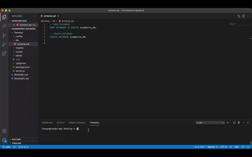

# E-Commerce Backend
  ## Licensing:
  
  ## Table of Contents 
  - [Description](#description)
  - [Installation](#installation)
  - [Usage](#usage)
  - [Contribution](#contribution)
  - [Testing](#testing)
  - [Questions?](#questions)
  ## Description:
  This project consists of building a functional back end using starter code. The application uses Express.js, Sequelize, and MySQL database. When the server starts and the Sequelized models are synced to the MySQL database, the user is then able to test all of the API GET, POST, PUT, and DELETE routes in Insomnia Core.
  ## Installation:
  You will need to seed the database by using 'npm run seed'.
  
  
  After that you can start the server by running 'node server'.  
  
  ## Usage:
  You can use Insomnia Core to test out the API models and routes.
  
  This demonstrates how to get all of the data from product, categories, and tags.
  
  
  This demonstrates how to get data from ID from product, categories, and tags.
  
  
  This demonstrates how to create new data into product, categories, and tags.
  
  
  This demonstrates how to update existing data from product, categories, and tags.
  
  
  This demonstrates how to delete existing data from product, categories, and tags.
  
  
  ## License:
  
  Copyright © Thang Nguyen. All rights reserved. 
  Licensed under the [MIT](https://opensource.org/licenses/MIT) license.
  ## Contribution:
  Anyone can contribute.
  ## Testing:
  Please install Insomnia Core to test out this application.
  ## Questions?
  - Github: [thangnt336](https://github.com/thangnt336)
  - Email: thangnt336@gmail.com 
